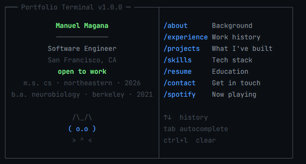

# Super Grool's Portfolio 
### Live: [https://magana272.github.io/portfolio/](https://magana272.github.io/portfolio/)

## Description
Welcome to my portfolio! This project showcases my skills and projects in web development. It is built using HTML, CSS, and JavaScript, and features a responsive design that works well on both desktop and mobile devices. The portfolio includes sections for my projects, skills, and contact information, allowing visitors to learn more about me and my work. Feel free to explore the projects I've worked on and get in touch if you'd like to collaborate or learn more about my experience!

## Features

- **Terminal-Style Interface** — Fully interactive CLI experience where visitors navigate the portfolio using commands (`/about`, `/projects`, `/experience`, `/skills`, `/resume`, `/contact`)
- **Command History & Autocomplete** — Arrow key navigation through previous commands and tab-based autocomplete for a seamless terminal workflow
- **Spotify Integration** — Live display of recently played tracks using the Spotify Web API with a client-side OAuth 2.0 PKCE flow, requiring no backend
- **Zero Dependencies** — Built entirely with vanilla HTML, CSS, and JavaScript — no frameworks, no build tools, no bloat
- **Object-Oriented Architecture** — Modular class-based design (`Terminal`, `Commands`, `Sidebar`, `Spotify`) for clean separation of concerns
- **Responsive Design** — Adapts between desktop and mobile layouts with a collapsible sidebar
- **Live Sidebar Widgets** — Real-time clock, uptime counter, and command usage tracker displayed alongside the terminal
